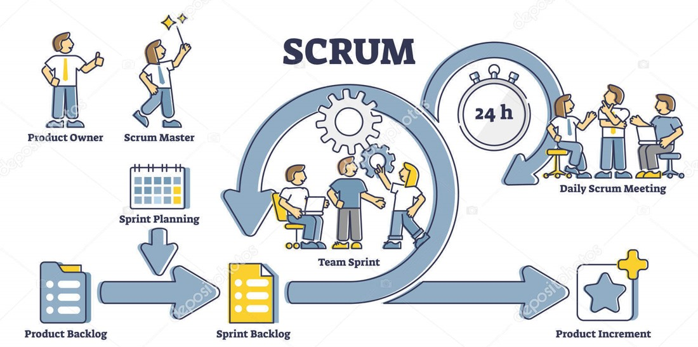
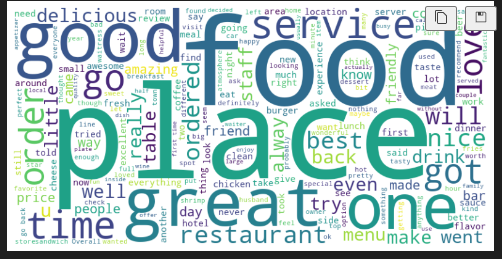
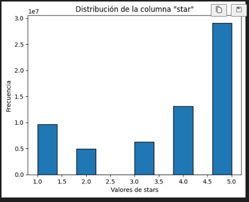

<h1 style="text-align: center;">Sistema de asesoria de establecimientos comerciales</h1>

  

Jupyx es una empresa líder en el campo de la ciencia de datos, comprometida con la innovación y la excelencia en el análisis de datos. Fundada con la visión de transformar datos en conocimiento valioso, Jupyx se ha destacado por ofrecer soluciones avanzadas y personalizadas a sus clientes en diversos sectores.

Servicios Ofrecidos
Análisis de Datos: Jupyx proporciona servicios de análisis de datos que ayudan a las empresas a descubrir patrones, tendencias y conocimientos ocultos en sus datos. Utilizando técnicas avanzadas de estadística y machine learning, Jupyx convierte datos crudos en información procesable.

Consultoría en Ciencia de Datos: La empresa ofrece consultoría experta para ayudar a las organizaciones a desarrollar estrategias de datos efectivas. Desde la planificación y arquitectura de datos hasta la implementación de soluciones de inteligencia artificial, Jupyx guía a sus clientes en cada paso del camino.

Desarrollo de Modelos Predictivos: Jupyx se especializa en la creación de modelos predictivos que permiten a las empresas anticiparse a las necesidades del mercado, optimizar operaciones y mejorar la toma de decisiones. Estos modelos se aplican en áreas como el marketing, finanzas, salud y más.

Visualización de Datos: La empresa destaca en la visualización de datos, creando dashboards interactivos y gráficos intuitivos que facilitan la comprensión y el análisis de grandes volúmenes de datos. Herramientas como Tableau y Power BI son parte de su arsenal para presentar datos de manera clara y atractiva.

## Contenido
1. [Introducción](#introducción)
2. [Objetivos](#objetivos)
3. [Metodología](#metodología-de-trabajo)
4. [Fuente de datos](#fuente-de-datos)
5. [EDA y Hallazgos](#eda-y-hallazgos)
6. [KPI´s propuestos](#kpis-propuestos)
7. [Stack de tecnologías](#stack-de-tecnologías-utilizadas)
8. [Conclusiones](#conclusiones)

# Introducción

La opinión de los usuarios es un dato muy valioso, que crece día a día gracias a plataformas de reseñas. Su análisis puede ser determinante para la planificación de estrategias. Yelp y Google son plataformas en donde los usuarios pueden realizar sus reseñas de todo tipo de negocios, restaurantes, hoteles, servicios, entre otros. Los usuarios utilizan el servicio de los negocios y luego suben su reseña según la experiencia que han recibido. Esta información es muy valiosa para las empresas, ya que les sirve para enterarse de la imagen que tienen los usuarios de los distintos locales de la empresa, siendo útil para medir el desempeño, utilidad del local, además de saber en qué aspectos hay que mejorar el servicio.
Además, Muchos usuarios leen las reseñas de los lugares a los que planean ir, sobre dónde comprar, comer, dormir, reunirse, entre otros y las reseñas posteadas en estas plataformas influyen mucho en la toma de decisiones. 
El sistema tiene como función un análisis del mercado de restaurantes ubicados en el estado California en Estados Unidos. Se ha solicitado a la empresa Jupix un análisis detallado de la opinión de los usuarios en Yelp y cruzarlos con los de Google Maps sobre en la ubicación antes mencionada. Se utilizará análisis de sentimientos para predecir cuáles serán los rubros de los negocios que más crecerán (o decaerán). Además, se desea saber dónde es conveniente emplazar los nuevos locales de restaurantes y afines, y desean poder tener un sistema de recomendación de restaurantes para los usuarios de ambas plataformas para darle, al usuario por ejemplo la posibilidad de poder conocer nuevos sabores basados en sus experiencias previas.

# Objetivos

1.	Recopilar, almacenar, transformar y disponibilizar la información:
o	Obtener datos de diferentes fuentes (API, Webscraping, CSV) para la evaluación de los datos y almacenaje en la nube.
o	Transformación de los datos.
o	Relación y análisis de los datos.
o	Creación de una base de datos (DataWarehouse) alojada en proveedores en la nube.
o	Disponibilizacion de datos.

2.	Reporte y análisis significativos de la línea de investigación escogidas:
o	El análisis debe contemplar las relaciones entre variables y concluir, si es que existe, una relación entre estas, y los posibles factores que causan dicha relación en la realidad.

3.	Entrenamiento y puesta en producción de un modelo de machine learning de clasificación no supervisado o supervisado:
o	Pendiente por procesar

# Metodología de trabajo
Utilizamos una combinación del Proceso Estándar Intersectorial para la Minería de Datos CRISP-DM con el marco de trabajo para gestionar proyecto de manera ágil, apoyandonos de plataformas como Trello.

    
    

# Fuente de datos 
Los datos son extraídos de la plataforma de reseñas Yelp y de Google Maps, para Estados Unidos. Tiene información sobre la ubicación de los comercios, su categoría, puntajes promedios, si están abiertos o no, sobre los usuarios, las reseñas que hicieron, cuántas reseñas hicieron, cuántos votos han recibido esas reseñas, entre otros. Se complementa con datos adicionales como la demografía y el ingreso per capita con el fin de ofrecer mayor detalle de información durante el análisis y la propuesta de negocio.

Los datos con los que realizamos el proyecto son:
- [Google maps](https://drive.google.com/drive/folders/1Wf7YkxA0aHI3GpoHc9Nh8_scf5BbD4DA?usp=share_link)
- [Yelp](https://drive.google.com/drive/folders/1TI-SsMnZsNP6t930olEEWbBQdo_yuIZF?usp=sharing)
- [Census](https://api.census.gov)
- [Datos macroeconómicos](https://datosmacro.expansion.com/)

# EDA y Hallazgos

Los archivos EDA contienen los análisis realizados a los datos antes mencionados a continuación se reseñaran las conclusiones obtenias en los archivos EDA.
Ideas de Análisis e Implementación
**Sectores Populares**

  

**Gastronomía y Servicios de Belleza:** La gastronomía y los servicios de belleza son los sectores más reseñados y mencionados en Yelp, lo que sugiere que son de gran interés para los usuarios.

**Cadenas de Comida Rápida y Servicios Rápidos:** Dominan tanto a nivel nacional como en estados específicos como California, sugiriendo oportunidades de expansión y crecimiento en estos sectores.  

**Participación de Usuarios**

  

 
**Usuarios Activos:** Aunque hay usuarios muy activos, la mayoría de los usuarios no reciben muchos votos en sus reseñas, indicando una participación moderada en la comunidad.

**Valoración de Reseñas Positivas**

  

  

  
**Tendencia Positiva:** Las reseñas positivas con altas calificaciones de estrellas tienden a recibir más votos útiles, lo que muestra una tendencia hacia la valoración de experiencias positivas.

**Tendencias y Oportunidades de Crecimiento**

  

 
La alta concentración de calificaciones moderadas a altas sugiere que hay un margen para que los negocios mejoren y alcancen calificaciones perfectas.
Analizando las cadenas con mejores reseñas a nivel nacional y filtrando estas para ver su desempeño en California, se pueden identificar oportunidades de crecimiento para negocios que aún no han alcanzado su máximo potencial en el estado.

**Enfoques en los que se podría basar el análisis para Negocios**
#### Foco en la Calidad

**Altos Estándares de Calidad:** Mantener altos estándares de calidad en productos y servicios es crucial para asegurar reseñas positivas y atraer a más clientes. Esto incluye no solo la calidad del producto, sino también la atención al cliente y la experiencia general.
#### Interacción con Usuarios

**Fomentar la Interacción:** Fomentar la interacción con los usuarios en Yelp para aumentar la visibilidad y mejorar la reputación.

**Responder a Reseñas:** Responder a las reseñas, tanto positivas como negativas, puede mostrar a los clientes que sus opiniones son valoradas y que el negocio está comprometido con la mejora continua.
#### Estrategias de Crecimiento
**Identificar Oportunidades de Expansión:** Identificar oportunidades de expansión en áreas con alta demanda y competencia.
**Ejemplo en California** En el estado de California, donde Starbucks tiene una presencia significativa, puede haber oportunidades para que otras cadenas de café o negocios relacionados crezcan.

### Con respecto al Estado de California
#### Distribución de Negocios
El estado de California tiene una alta concentración de negocios registrados en Yelp, con una notable preponderancia de cadenas de comida rápida y servicios rápidos como Starbucks, McDonald's y Subway.
Los gráficos mostraron que Starbucks es la cadena con mayor presencia en el estado, seguida por McDonald's y Subway, lo que destaca la importancia del sector gastronómico en la plataforma.
**Calificaciones de Negocios**
#### Distribución de Calificaciones
La mayoría de los negocios en California reciben calificaciones moderadas a altas (entre 3.0 y 4.5 estrellas).
Las calificaciones más frecuentes son de 3.5 estrellas, seguidas de cerca por 4.0 estrellas. Las calificaciones perfectas de 5.0 estrellas son menos comunes, lo que sugiere que alcanzar una calificación perfecta es un desafío.
La distribución sugiere una tendencia positiva en la satisfacción del cliente, con la mayoría de los negocios recibiendo reseñas relativamente favorables.
#### Interacción de los Usuarios
**Votos Útiles y Calificaciones**
El análisis de la relación entre los votos útiles y las calificaciones de estrellas mostró que las reseñas con calificaciones más bajas (1.0 a 2.5 estrellas) tienden a recibir menos interacción útil.
Las calificaciones moderadas a altas (3.0 a 4.5 estrellas) no solo son más frecuentes, sino que también parecen recibir más votos útiles, indicando que los usuarios de Yelp encuentran estas reseñas más relevantes o informativas.

#### Implicaciones para Negocios Nuevos y Existentes
**Visibilidad y Competencia**
Los negocios en California tienen una buena visibilidad en Yelp, lo que puede traducirse en una fuerte competencia, especialmente en el sector de la comida rápida.
Los negocios nuevos deben enfocarse en obtener y mantener calificaciones altas para destacar en la plataforma, mientras que los negocios existentes deben continuar mejorando sus servicios para mantener o mejorar sus calificaciones actuales.

#### Consideraciones para Estrategias de Marketing
**Enfoque en la Satisfacción del Cliente**
Las empresas deben priorizar la satisfacción del cliente y buscar activamente feedback para mejorar sus servicios.
Las estrategias de marketing deben destacar las calificaciones positivas y los aspectos en los que los negocios se destacan, utilizando las reseñas favorables como una herramienta para atraer más clientes.

# KPIs propuestos

1.	Para el Análisis de Opiniones y Sentimientos:
- Insights Clave: Porcentaje de reseñas destacando factores específicos de éxito.
 
-	Satisfacción del Cliente: Niveles de satisfacción general y puntuaciones promedio.
 
2.	Para las Estrategias de Marketing y Lanzamiento:
-	Reconocimiento de Marca: Incremento en la visibilidad y el reconocimiento de la nueva marca.
 

# Stack de Tecnologías

En este proyecto se ha empleado un conjunto de tecnologías y herramientas para la recolección, análisis y visualización de datos, así como para la automatización y gestión de los procesos. A continuación, se detalla el stack de tecnologías utilizado:
1. Python y Librerías de Análisis de Datos
Para la lectura, análisis y visualización de los datasets se ha utilizado Python junto con una variedad de librerías especializadas:
•	Pandas: Utilizada para la manipulación y análisis de datos estructurados. Permite cargar, limpiar y transformar datos.
•	Matplotlib: Empleada para la creación de gráficos y visualizaciones básicas.
•	Seaborn: Librería basada en Matplotlib que proporciona una interfaz de alto nivel para dibujar atractivas y complejas visualizaciones estadísticas.
•	JSON: Utilizada para la manipulación y análisis de datos en formato JSON.
•	WordCloud: Empleada para generar nubes de palabras a partir de texto.
•	NLTK: Biblioteca para el procesamiento del lenguaje natural (Natural Language Toolkit), utilizada para la limpieza y análisis de texto.
•	Wrangler: Herramienta para la transformación y limpieza de datos.
•	Otras librerías: Además de las mencionadas, existe la posibilidad de que durante el desarrollo del proyecto se anexen nuevas herramientas para el procesamiento de los datos.
2. Plataforma Google Cloud
Para la automatización y disponibilización de los datos se han utilizado diversos servicios de Google Cloud:
•	Google Cloud Storage (Buckets): Almacenamiento de datos en la nube.
•	Google Cloud Dataproc (Clusters): Proceso de datos utilizando clusters de Hadoop y Spark.
•	Google Cloud Composer: Servicio gestionado para la orquestación de flujos de trabajo basado en Apache Airflow.
•	Google Cloud S3: Servicio de almacenamiento de objetos.
•	Google Cloud BigQuery: Almacenamiento y análisis de grandes volúmenes de datos.
3. Automatización y Orquestación
•	Apache Airflow: Empleado para la automatización y orquestación de flujos de trabajo. Utilizado a través de Google Cloud Composer.
4. Gestión de Documentación y Repositorios
•	Git: Sistema de control de versiones distribuido utilizado para el seguimiento de cambios en el código fuente.
•	GitHub: Plataforma para alojamiento de repositorios Git. Utilizada para la colaboración y gestión del código fuente del proyecto.
5. Gestión de Tareas y Cronogramas
•	Trello: Herramienta de gestión de proyectos y tareas, utilizada para la planificación, asignación y seguimiento de las tareas del equipo.

  

# Conclusiones
1.	Dominio del Análisis de Opiniones: Utilizar el poder del análisis de sentimientos para descubrir los secretos del éxito y fracaso de los restaurantes en California. Jupix identificará los rubros clave que generan experiencias positivas y negativas, proporcionando una visión precisa sobre cómo optimizar la oferta y superar a la competencia.
2.	Ubicaciones Estratégicas para el Éxito: Evaluar y recomendar las ubicaciones más prometedoras para el lanzamiento de una nueva marca de restaurantes. Basándonos en un análisis detallado de factores demográficos, económicos y de competencia, garantizaremos que cada nuevo restaurante esté estratégicamente posicionado para capturar una alta cuota de mercado y atraer al público objetivo.
3.	Sistema de Recomendación Premium: Desarrollar un sistema de recomendación avanzado que destaque los mejores restaurantes en función de los factores de éxito identificados. Este sistema servirá como guía para emular las estrategias de los líderes del mercado y evitar los errores de los rezagados.
4.	Estrategias de Marketing y Lanzamiento de Alto Impacto: Crear campañas de marketing microsegmentadas que no solo alcancen, sino que resuenen profundamente con el público objetivo. Jupix diseñará estrategias de lanzamiento que aseguren una entrada poderosa y memorable en el mercado.

